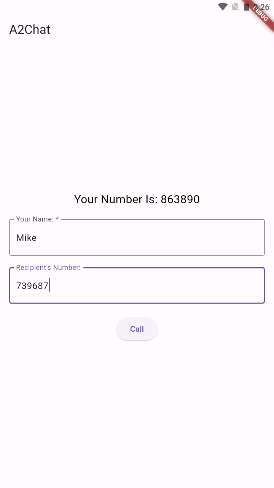
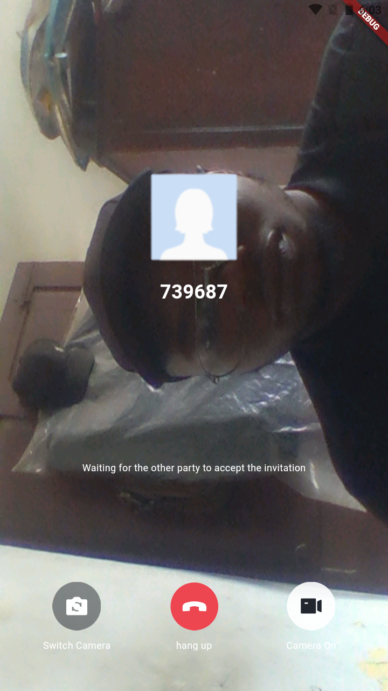

# a2chat

A2Chat is a simple Flutter app that allows two users to join a video call over the internet using Tencent's TUICALLKIT. The app focuses on providing a straightforward experience without the need for sign-up or login. Users can easily make and receive video calls with notifications that work in the foreground, background, and even when the phone is terminated.

TUICallKit is a video and audio communication component built on Tencent Cloud's Instant Messaging and Tencent Real-Time Communication TRTC, two paid PaaS services.

## Requirements

- Flutter 3.0 or above
- Developing for Android:Android Studio 3.5 or above Devices with Android 4.1 or above

## Getting Started

- Sign Up To Tencent Cloud at https://www.tencentcloud.com/account/register
- Create An Application in the console. (https://console.intl.cloud.tencent.com/im)
- Note down your application SDKAppID and SecretKey
- Find the Call Card and click Try Now then click "Activate"
- Clone this Repository.
- In the generate_test_user_sig.dart file in the lib directory assign sdkAppId and secretKey with you applications appId and secret key obtained earlier.
- Run "flutter pub get" in the projects terminal to download dependencies.
- Run "flutter run" to start the application.

## Home Screen

## Calling Screen

